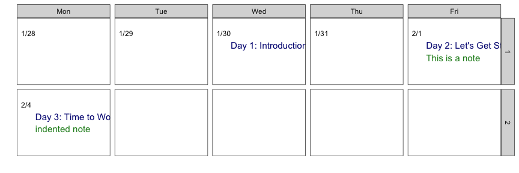

<!-- README.md is generated from README.Rmd. Please edit that file -->

# calendar

<!-- badges: start -->

<!-- badges: end -->

## Installation

You can install from [GitHub](https://github.com/) with:

``` r
# install.packages("devtools")
devtools::install_github("rpruim/calendar")
```

## Example

``` r
library(calendar)
library(dplyr)
cal <-
  daily2cal(
    path  = system.file("daily.txt", package = "calendar"),
    start = lubridate::mdy("1/28/2019"),
    mask  = c(2, 4, 6)
  ) 
```

``` r
calendar_css() %>% cat()
```

<style type="text/css">
span.headerColor {
    color: #906;
    color: #966;
    background: #fff;
}

span.bigger {font-size: larger}
span.smaller {font-size: smaller}

span.topic, span.Topic {
    color: black;
    font-size: medium;
    font-weight: bold;
/* #    font-variant: small-caps; */
}

span.topic a:link, span.topic a:visited{
    color: blue;
}

span.Topic a:link, span.Topic a:visited{
    color: blue;
}

span.reading, span.Reading {
    font-style: italic;
    color: #36c;
}
span.reading a:link, span.reading a:visited{
    color: blue;
}
span.Reading a:link, span.Reading a:visited{
    color: blue;
}

span.vocab, span.Vocab {
    color: purple;
}

span.notes, span.Notes {
    color: green;
}

span.R {
    color: purple;
    font-family: "Lucida Console", "Courier New", Monospace;
}

span.Note, span.note {
    color: green;
}

span.activity, span.Activity {
    color: #c63;
}

span.activity a:link, span.activity a:visited{
    color: brown;
}

span.Activity a:link, span.Activity a:visited{
    color: brown;
}

span.due, span.Due {
    /* color: #969; */
    color: red;
}

span.due a:link, span.due a:visited{
    color: red;
}

span.Due a:link, span.Due a:visited{
    color: red;
}

body, td{
    color: #000;
    /* background: #fff; */
    font-family: sans-serif, arial, helvetica, verdana;
    }

body td{
    color: #000;
    background: #ccc;
    font-family: sans-serif, arial, helvetica, verdana;
    }

body td.odd{
    color: #000;
    background: #fff;
    font-family: sans-serif, arial, helvetica, verdana;
    }

body td.even{
    color: #000;
    background: #ccc;
    font-family: sans-serif, arial, helvetica, verdana;
    }

td {
    padding: 10px;
    text-align: left;
    vertical-align: top;
}

th{
    color: #000;
    /* background: #fff; */
    font-family: sans-serif, arial, helvetica, verdana;
    }

/*hr {text-align: center; margin-left: 25%; width: 50%; margin-right: 25%}*/

hr {
    color: #906;
    color: #966;
    background: #fff;
}


h1, h2, h3, h4{
    color: #906;
    color: #336;
    background: #fff;
}


h1 a:link, h1 a:visited, h2 a:link, h2 a:visited, h3 a:link, h3 a:visited {
    color: #36c;
    color: #66c;
    color: #339;
    background: #fff;
    text-decoration: none;
}

h1 {     font-size: x-large;
}

h1 span.smaller{
    color: #000;
    background: #fff;
    font-size: large;
}

h1 span.smallest{
    color: #000;
    background: #fff;
    font-size: medium;
}

h2 {    font-size: large;
    font-style: normal;
}

h2 span.smaller, h2 span.smallest{
    color: #000;
    background: #fff;
    font-size: medium;
}

h3 {    font-size: medium;
    font-style: normal;
}

h3 span.smaller, h3 span.smallest{
    color: #000;
    background: #fff;
}

h4 {    font-size: medium;
    font-style: italic;
}


a:link {
    color: #36c;    /* #06c */
    color: #06c;    /* #06c */
    background: #fff;
    text-decoration: none;
}

a:visited {
    /*color: #09c; color: #96c; #936 ; #939
    background: #fff;*/
    color: #969;
    background: #fff;
}

strong {
    color: #906;
    background: #fff;
}
</style>

``` r
cal %>% html_calendar(show = 2:6) %>% cat()
```

<table border=1 width=95%>

<colgroup>

<col width = "10%">

<col width = "10%">

<col width = "10%">

<col width = "10%">

<col width = "10%">

</colgroup>

<thead>

<tr>

<th>

Mon

</th>

<th>

Tue

</th>

<th>

Wed

</th>

<th>

Thu

</th>

<th>

Fri

</th>

</tr>

</thead>

<tbody>

<tr>

<!--  1 > -Inf -->

</tr>

<tr>

<td class="odd">

1/28<br><span class="Topic"></span><br><span class="Read"></span><br><span class="Note"></span><br><span class="Due"></span><br><br>

</td>

<td class="odd">

1/29<br><span class="Topic"></span><br><span class="Read"></span><br><span class="Note"></span><br><span class="Due"></span><br><br>

</td>

<td class="odd">

1/30<br><span class="Topic">Day 1:
Introduction</span><br><span class="Read">Syllabus</span><br><span class="Note"></span><br><span class="Due"></span><br><br>

</td>

<td class="odd">

1/31<br><span class="Topic"></span><br><span class="Read"></span><br><span class="Note"></span><br><span class="Due"></span><br><br>

</td>

<td class="even">

2/1<br><span class="Topic">Day 2: Let’s Get
Started</span><br><span class="Read">Chapter
1</span><br><span class="Note">This is a
note</span><br><span class="Due"></span><br><br>

</td>

<!--  2 > 1 -->

</tr>

<tr>

<td class="even">

2/4<br><span class="Topic">Day 3: Time to
Work</span><br><span class="Read">Chapter
2</span><br><span class="Note">indented
note</span><br><span class="Due">Assignment 1</span><br><br>

</td>

</tr>

</tbody>

</table>

``` r
cal %>% gg_calendar(show = 2:6, size = 4)
```


